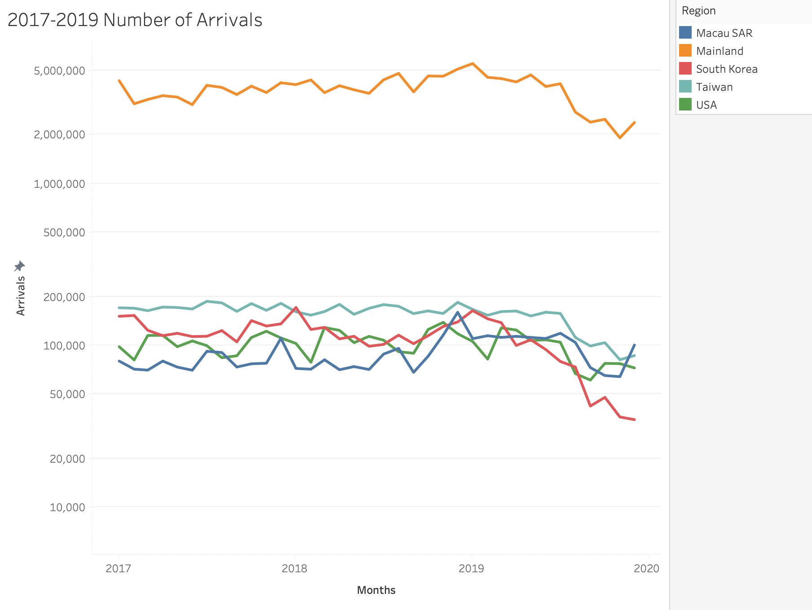
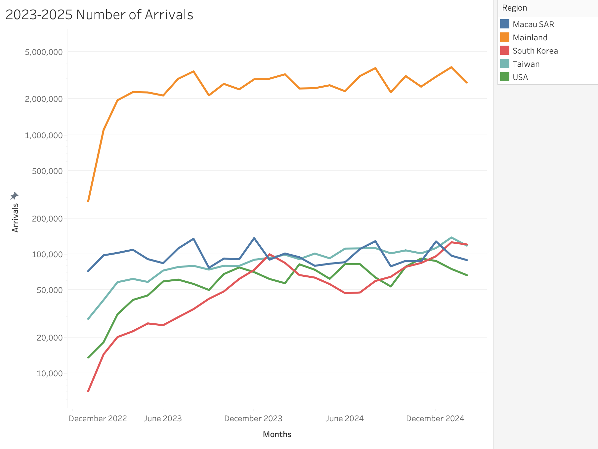
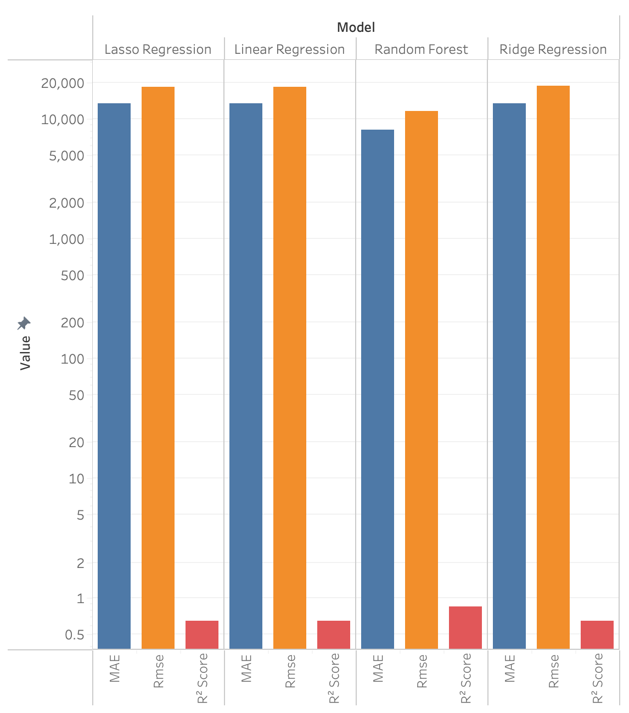
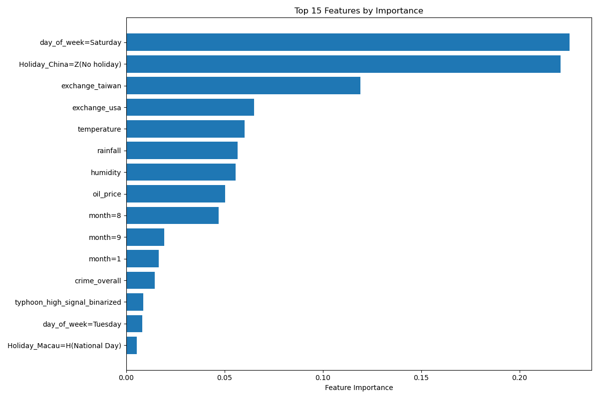
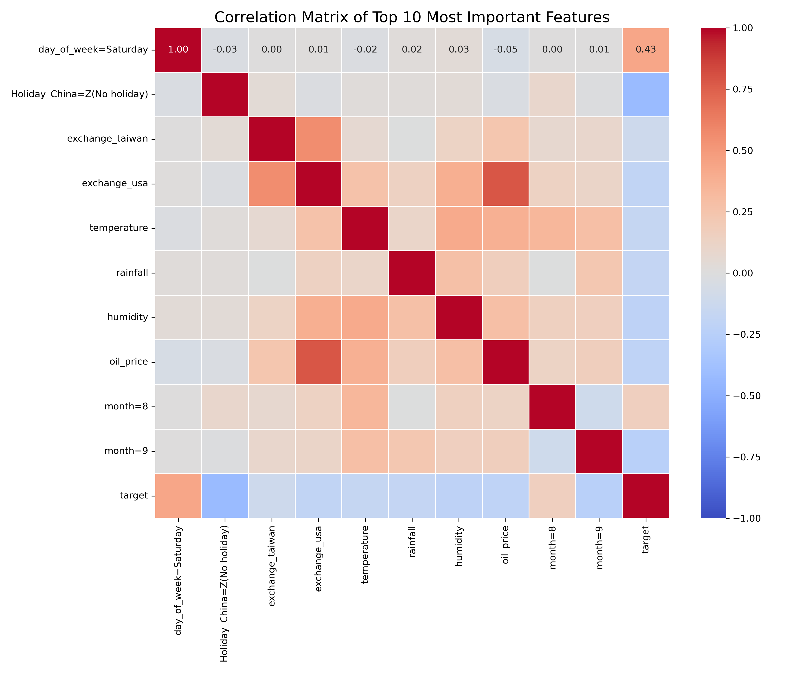
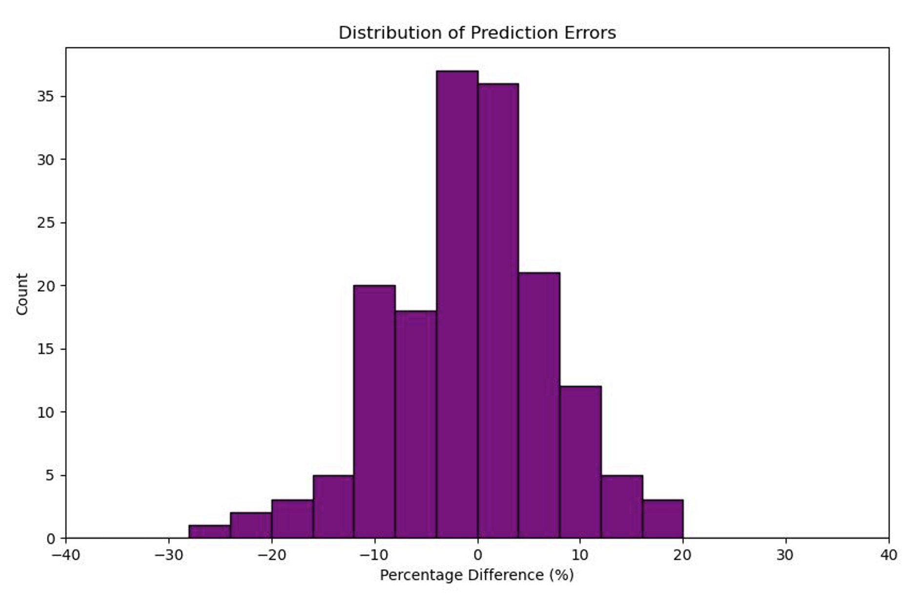
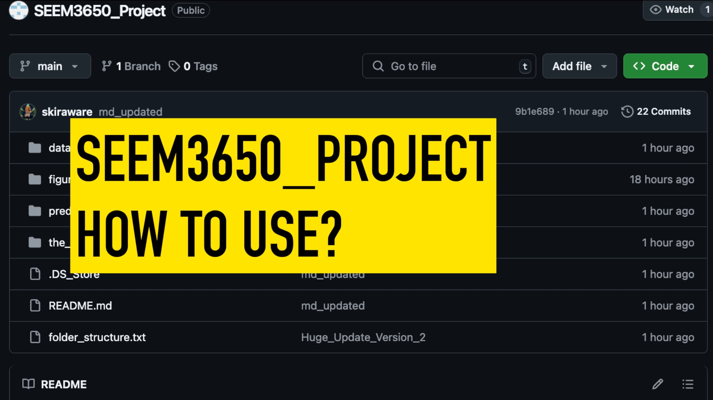

# Analyzing Factors Influencing Traveler Visits to Hong Kong

This project utilizes machine learning, specifically Random Forest regression, to identify key factors influencing tourist visits to Hong Kong. By analyzing economic, environmental, and social indicators, we aim to provide actionable insights for policymakers to boost tourism, which has declined in recent years.

## Background

Tourism in Hong Kong has experienced significant fluctuations over the past decade, particularly around the COVID-19 pandemic. Understanding these trends is crucial for developing strategies to revitalize the industry.

### Traveler Numbers Pre-Pandemic (2017-2019)
  
This line graph tracks the number of arrivals from Macau SAR, Mainland, South Korea, Taiwan, and USA from 2017 to 2020, showing a significant decline towards 2020, particularly for Mainland and South Korea. The data highlights the impact of pre-pandemic events, such as protests in 2019, and the onset of the global health crisis.

### Traveler Numbers Post-Pandemic (2023-2025)
  
This line graph projects the number of arrivals from the same regions from December 2022 to December 2024, indicating a recovery with increasing trends, especially for the Mainland. The upward trajectory suggests a rebound in tourism as travel restrictions eased and confidence returned.

## Project Overview

The study examines factors affecting daily visitor arrivals to Hong Kong from 2019 to 2025, excluding the COVID-19 period (2020-2022). Using a Random Forest model, we predict arrivals based on features like economic conditions, weather, holidays, and crime rates. Key findings indicate that holidays in source countries, crime rates, and weather significantly influence tourism, suggesting policies focused on safety and holiday promotions could enhance visitor numbers.

## Dataset

Data is sourced from platforms such as the Census and Statistics Department, Hong Kong Immigration Department, and international databases. The dataset includes:

- **Response Variable (Y)**: Daily visitor arrivals.
- **Features (X)**: 40 attributes spanning economic (e.g., GDP, exchange rates), environmental (e.g., temperature, rainfall), social (e.g., crime rates), and cultural (e.g., holidays, events) factors.

### Data Preprocessing

- **Cleaning**: Excluded missing values and the COVID-19 period (2020-2022).
- **Standardization**: Applied to continuous variables for outlier management.
- **Dummy Variables**: Created for categorical variables.
- **Feature Selection**: Reduced 133 attributes to 31 highly correlated features (e.g., "days without holiday," "Labor Day," "HK crime rate") using correlation analysis.

The processed dataset contains 819 records with 31 features.

## Methodology

We evaluated four regression models—Linear Regression, Ridge Regression, LASSO Regression, and Random Forest Regression—using an 80/20 train-test split.

- **Models Evaluated**:
  - Linear Regression
  - Ridge Regression
  - LASSO Regression
  - Random Forest Regression

- **Performance Metrics**:
  - Mean Absolute Error (MAE)
  - Root Mean Squared Error (RMSE)
  - R-squared (R²)

Random Forest outperformed others with a training MAE of 8,146.33, RMSE of 11,813.83, and R² of 0.8626, though cross-validation (MAE: 16,389.61) suggests potential overfitting.

## Model Evaluation

### Model Performance Comparison
  
This bar chart compares the performance of four regression models—Lasso, Linear, Random Forest, and Ridge—using Mean Absolute Error (MAE), Root Mean Squared Error (RMSE), and R-squared Score (R² Score) on a logarithmic scale. Random Forest shows superior performance with lower errors and a higher R².

### Feature Importances
  
This plot identifies the most influential features in the Random Forest model, such as holidays, crime rates, and weather conditions.

### Top Features Correlation
  
Correlation matrix highlighting the relationship between top features and visitor arrivals, with 'Day of week = Saturday' showing the highest correlation.

## Results

The Random Forest model was selected for its strong performance. Key insights include:

- **Significant Predictors**: Holidays in source countries, crime rates, and weather.
- **Test Set Performance**:
  - Mean Percentage Difference: 6.4%
  - Standard Deviation: 5.8%
  - Most errors near 0%, indicating low bias.

In addition to the above, the following table provides a detailed comparison of the actual and predicted values:

| Metric  | y          | Predicted y | Difference  | Percentage Diff (%) |
|---------|------------|-------------|-------------|---------------------|
| min     | 90747      | 97597.5928  | 164.0982308 | 0.14438701          |
| max     | 221472     | 190419.982  | 45936.14302 | 42.98239297         |
| mean    | 132899.067 | 132769.724  | 8621.14965  | 6.401448664         |
| sd      | 29130.0372 | 23596.0478  | 8141.688018 | 5.771243395         |
| Median  | 125667     | 124219.259  | 6632.00191  | 4.694425098         |

**Table 1: Performance of the Model Prediction**

Furthermore, the distribution of prediction errors is illustrated in the histogram below:

  
The histogram shows the distribution of the difference between the predicted and actual y. It is found that the difference is most significant in the range of -30% to -5%, and the difference is concentrated in the range close to 0. As a result, the bias of the predicted data is low, and most of the data is reasonable. Only a small portion of the predicted data is an outlier. This prediction model is closer to the expected ideal situation of a 5% difference.

## Repository Structure

The repository is organized as follows:

- **data_preprocessing/**: Scripts and data for preprocessing.
  - **data_cleaning_python/**: Python scripts for cleaning (e.g., `crime_data_clean.py`).
  - **features_csv/**: Processed feature files (e.g., `processed_crime_data.csv`).
  - **readyset_data_csv/**: Final datasets (e.g., `train.csv`, `test.csv`).
  - **y_csv/**: Target data (e.g., `statistics_on_daily_passenger_traffic.csv`).
  - **feature_selected_dataset.csv**: Post-selection dataset.
  - **original_dataset.csv**: Cleaned original dataset.

- **predict_model/**: Model-related files.
  - `find_model.py`: Trains and saves the best model (`best_model.pkl`).
  - `predict.py`: Generates predictions (`predict.csv`).
  - `train.csv` & `test.csv`: Training and testing datasets.

- **figures/**: Visualizations (e.g., `feature_importances.png`).
- **the_result/**: Outputs.
  - `best_model.pkl`: Trained Random Forest model.
  - `predict.csv`: Test set predictions.

## Usage

To use this repository:

1. **Clone the repository**:
   ```bash
   git clone https://github.com/tonykan1122/SEEM3650_Project.git
   ```
2. **Install dependencies**:
   ```bash
   pip install pandas scikit-learn==1.4.1.post1 numpy matplotlib seaborn
   ```
3. **Train the model**:
   ```bash
   python predict_model/find_model.py
   ```
   - Outputs `best_model.pkl` in `the_result/`.
4. **Generate predictions**:
   ```bash
   python predict_model/predict.py
   ```
   - Saves predictions to `the_result/predict.csv`.

For a step-by-step guide, watch the [YouTube tutorial](https://youtu.be/RJ8WPKeVXF8) or click the image below to watch the tutorial video!
[](https://youtu.be/RJ8WPKeVXF8)  

## Pros, Cons, and Potential Improvements

### Pros

- High accuracy due to Random Forest’s non-linear modeling.
- Clear feature importance insights.
- Robust to outliers and diverse scales.

### Cons

- Potential overfitting (training vs. cross-validation MAE gap).
- Higher computational and storage demands.

### Potential Improvements

- **Feature Engineering**: Add interaction terms (e.g., temperature-humidity).
- **Hyperparameter Tuning**: Optimize Random Forest to reduce overfitting.
- **Model Ensemble**: Combine strengths of multiple models.
- **Real-Time Data**: Integrate web scraping for current data.

## Societal Impact

- **Travelers**: Predict peak times to avoid crowds.
- **Government**: Inform policies targeting crime and holidays.
- **Businesses**: Optimize promotions for high-visitor periods.

Over-reliance on the model without critical evaluation could lead to economic risks.

## Future Development

- **Expand Attributes**: Include more events and refine features.
- **User Interface**: Develop a platform for easier model access.
- **Automation**: Add real-time data scraping.
- **Global Adaptation**: Extend the model to other regions.

## Contributors

- Fung Sai Wa (1155194766)
- Kan Man Chung (1155181978)
- Leung Shing Yip (1155193525)

For more details, visit the [GitHub repository](https://github.com/tonykan1122/SEEM3650_Project.git).

## Appendix/Source

| **Attribute**            | **Source**                                                                                                   |
|--------------------------|--------------------------------------------------------------------------------------------------------------|
| event_protest            | [TW Reporter](https://www.twreporter.org/a/hong-kong-extradition-law-events)                                 |
| days_to_event_marathon   | [Wikipedia](https://zh.wikipedia.org/wiki/%E6%B8%A3%E6%89%93%E9%A6%99%E6%B8%AF%E9%A6%AC%E6%8B%89%E6%9D%BE) |
| days_to_event_creamfields| [Yolo Lab](https://yololab.net/2019/10/31/creamfields-hk/), [Klook](https://www.klook.com/zh-HK/event-detail/101011362-2023-creamfields-hongkong/), [Instagram](https://www.instagram.com/creamfieldshk/p/C5ktFguyBzu/?img_index=1) |
| days_to_event_complexcon | [InvestHK](https://www.investhk.gov.hk/zh-hk/events/complexcon-hong-kong-2024/), [Asia World-Expo](https://www.asiaworld-expo.com/zh-tc/whats-on/upcoming-events/events/complexcon-hong-kong-2025-\(1st-option-17-24-3,-2nd/) |
| days_to_event_hksevens   | [HK Sevens 2025](https://hksevens.com/assets/uploads/uploads/images/HK7s-2025_Full-Schedule_V3.pdf), [HK Sevens 2024](https://hksevens.com/assets/uploads/uploads/images/240306_hk7s_2024_schedule-v5.3A4.pdf), [TD](https://www.td.gov.hk/filemanager/en/content_13/Hong%20Kong%20Sevens%202023%20Full_Chi.pdf), [SCMP](https://multimedia.scmp.com/widgets/sport/rugby-schedule-2022/index.html), [Wikipedia](https://en.wikipedia.org/wiki/2019_Hong_Kong_Sevens) |
| days_to_event_clockenflap| [Wikipedia](https://zh.wikipedia.org/wiki/Clockenflap), [Clockenflap](https://www.clockenflap.com/)         |
| max_signal               | [HKO](https://www.hko.gov.hk/en/wxinfo/climat/warndb/warndb1.shtml)                                         |
| event_marathon           | [Wikipedia](https://zh.wikipedia.org/wiki/%E6%B8%A3%E6%89%93%E9%A6%99%E6%B8%AF%E9%A6%AC%E6%8B%89%E6%9D%BE) |
| event_creamfields        | [Yolo Lab](https://yololab.net/2019/10/31/creamfields-hk/), [Klook](https://www.klook.com/zh-HK/event-detail/101011362-2023-creamfields-hongkong/), [Instagram](https://www.instagram.com/creamfieldshk/p/C5ktFguyBzu/?img_index=1) |
| event_complexcon         | [InvestHK](https://www.investhk.gov.hk/zh-hk/events/complexcon-hong-kong-2024/), [Asia World-Expo](https://www.asiaworld-expo.com/zh-tc/whats-on/upcoming-events/events/complexcon-hong-kong-2025-\(1st-option-17-24-3,-2nd/) |
| event_hksevens           | [HK Sevens 2025](https://hksevens.com/assets/uploads/uploads/images/HK7s-2025_Full-Schedule_V3.pdf), [HK Sevens 2024](https://hksevens.com/assets/uploads/uploads/images/240306_hk7s_2024_schedule-v5.3A4.pdf), [TD](https://www.td.gov.hk/filemanager/en/content_13/Hong%20Kong%20Sevens%202023%20Full_Chi.pdf), [SCMP](https://multimedia.scmp.com/widgets/sport/rugby-schedule-2022/index.html), [Wikipedia](https://en.wikipedia.org/wiki/2019_Hong_Kong_Sevens) |
| event_clockenflap        | [Wikipedia](https://zh.wikipedia.org/wiki/Clockenflap), [Clockenflap](https://www.clockenflap.com/)         |
| typhoon_morning          | [HKO](https://www.hko.gov.hk/en/wxinfo/climat/warndb/warndb1.shtml)                                         |
| typhoon_present          | [HKO](https://www.hko.gov.hk/en/wxinfo/climat/warndb/warndb1.shtml)                                         |
| typhoon_high_signal      | [HKO](https://www.hko.gov.hk/en/wxinfo/climat/warndb/warndb1.shtml)                                         |
| typhoon_duration_hours   | [HKO](https://www.hko.gov.hk/en/wxinfo/climat/warndb/warndb1.shtml)                                         |
| temperature              | [Data.gov.hk](https://data.gov.hk/en-data/dataset/hk-hko-rss-daily-temperature-info-hko), [HKO April 2025](https://www.hko.gov.hk/en/cis/dailyExtract.htm?y=2025&m=04) |
| rainfall                 | [Data.gov.hk](https://data.gov.hk/en-data/dataset/hk-hko-rss-daily-total-rainfall), [HKO April 2025](https://www.hko.gov.hk/en/cis/dailyExtract.htm?y=2025&m=04) |
| humidity                 | [Data.gov.hk](https://data.gov.hk/en-data/dataset/hk-hko-rss-daily-mean-relative-humidity), [HKO April 2025](https://www.hko.gov.hk/en/cis/dailyExtract.htm?y=2025&m=04) |
| crime_overall            | [HK Police](https://www.police.gov.hk/ppp_en/09_statistics/csd.html)                                        |
| oil_price                | [EIA](https://www.eia.gov/dnav/pet/hist/LeafHandler.ashx?n=pet&s=f000000__3&f=m), [Business Insider](https://markets.businessinsider.com/commodities/oil-price?type=wti), [Statista](https://www.statista.com/statistics/326017/weekly-crude-oil-prices/) |
| cpi_composite            | [CSD Department CPI](https://www.censtatd.gov.hk/en/web_table.html?id=510-60001), [HK Economy 2025](https://www.hkeconomy.gov.hk/en/situation/development/index.htm) |
| cpi_a                    | [CSD Department CPI](https://www.censtatd.gov.hk/en/web_table.html?id=510-60001), [HK Economy 2025](https://www.hkeconomy.gov.hk/en/situation/development/index.htm) |
| cpi_b                    | [CSD Department CPI](https://www.censtatd.gov.hk/en/web_table.html?id=510-60001), [HK Economy 2025](https://www.hkeconomy.gov.hk/en/situation/development/index.htm) |
| cpi_c                    | [CSD Department CPI](https://www.censtatd.gov.hk/en/web_table.html?id=510-60001), [HK Economy 2025](https://www.hkeconomy.gov.hk/en/situation/development/index.htm) |
| gdp                      | [CSD Department GDP and GDP Deflator](https://www.censtatd.gov.hk/en/web_table.html?id=31), [HK Economy 2025](https://www.hkeconomy.gov.hk/en/situation/development/index.htm) |
| gdp_deflator_index       | [CSD Department GDP and GDP Deflator](https://www.censtatd.gov.hk/en/web_table.html?id=31), [HK Economy 2025](https://www.hkeconomy.gov.hk/en/situation/development/index.htm) |
| exchange_mainland        | [Exchange Rates Mainland](https://www.exchangerates.org.uk/CNY-HKD-spot-exchange-rates-history-2019.html)    |
| exchange_taiwan          | [Exchange Rates Taiwan](https://www.exchangerates.org.uk/TWD-HKD-spot-exchange-rates-history-2019.html)      |
| exchange_macausar        | [Exchange Rates Macau](https://www.exchangerates.org.uk/MOP-HKD-spot-exchange-rates-history-2019.html)       |
| exchange_southkorea      | [Exchange Rates South Korea](https://www.exchangerates.org.uk/KRW-HKD-spot-exchange-rates-history-2019.html) |
| exchange_usa             | [Exchange Rates USA](https://www.exchangerates.org.uk/USD-HKD-spot-exchange-rates-history-2019.html)         |
| y (arrival_travellers)   | [Data.gov.hk: Daily Passenger Traffic after 2022](https://data.gov.hk/en-data/dataset/hk-immd-set5-statistics-daily-passenger-traffic), [Data.gov.hk: Daily Passenger Traffic before 2021](https://data.gov.hk/en-data/dataset/hk-immd-set5-statistics-daily-passenger-traffic) |